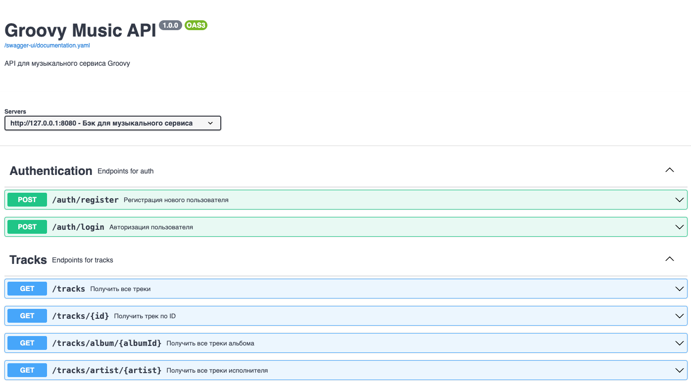

# Groovy-backend

Бэкенд для приложения прослушивания музыки


Groovy-backend — это серверная часть музыкального сервиса, реализованная на Kotlin с использованием Ktor. Сервис предоставляет REST API для управления треками, альбомами, плейлистами, лайками и прослушиваниями, а также поддерживает аутентификацию (авторизация реализована через PostgreSQL). Данные хранятся в Firestore и Firebase Storage. Проект подходит для мобильных и веб-клиентов, аналогичных Spotify или Яндекс.Музыке.

## Быстрый старт

1. **Клонируйте репозиторий и настройте переменные окружения:**
   - `FIREBASE_PROJECT_ID`
   - `GOOGLE_APPLICATION_CREDENTIALS` (путь к вашему serviceAccountKey.json)
2. **Запустите приложение:**
   ```bash
   ./gradlew run
   ```
3. **API будет доступно по адресу:**  
   `http://localhost:8080`

---

## Аутентификация

| Метод | URL              | Описание                |
|-------|------------------|-------------------------|
| POST  | `/auth/register` | Регистрация пользователя|
| POST  | `/auth/login`    | Вход пользователя       |

**Пример запроса на регистрацию:**
```json
POST /auth/register
{
  "email": "user@example.com",
  "password": "password123"
}
```

**Пример запроса на вход:**
```json
POST /auth/login
{
  "email": "user@example.com",
  "password": "password123"
}
```

---

### Треки

| Метод | URL                           | Описание                        |
|-------|-------------------------------|----------------------------------|
| GET   | `/tracks`                     | Получить все треки               |
| GET   | `/tracks/{id}`                | Получить трек по ID              |
| GET   | `/tracks/album/{albumId}`     | Получить треки по альбому        |
| GET   | `/tracks/artist/{artist}`     | Получить треки по исполнителю    |
| GET   | `/tracks/search?q=...`        | Поиск треков по названию         |
| GET   | `/tracks/top?limit=10`        | Топ треков                       |
| GET   | `/tracks/recent?limit=10`     | Последние добавленные треки      |
| GET   | `/tracks/liked/{userId}`      | Лайкнутые треки пользователя     |

**Пример:**
```
GET /tracks/artist/Imagine%20Dragons
```

---

### Альбомы

| Метод | URL                           | Описание                        |
|-------|-------------------------------|----------------------------------|
| GET   | `/albums`                     | Получить все альбомы             |
| GET   | `/albums/{id}`                | Получить альбом по ID            |
| GET   | `/albums/artist/{artist}`     | Получить альбомы по исполнителю  |
| GET   | `/albums/search?q=...`        | Поиск альбомов по названию       |
| GET   | `/albums/genre/{genre}`       | Получить альбомы по жанру        |

**Пример:**
```
GET /albums/search?q=rock
```

---

### Плейлисты

| Метод | URL                              | Описание                                 |
|-------|-----------------------------------|-------------------------------------------|
| POST  | `/playlists`                      | Создать плейлист                          |
| GET   | `/playlists/{id}`                 | Получить плейлист по ID                   |
| PUT   | `/playlists/{id}`                 | Обновить плейлист                         |
| DELETE| `/playlists/{id}`                 | Удалить плейлист                          |
| POST  | `/playlists/{id}/tracks`          | Добавить треки в плейлист (body: [id])    |
| DELETE| `/playlists/{id}/tracks`          | Удалить треки из плейлиста (body: [id])   |
| GET   | `/playlists/user/{userId}`        | Получить плейлисты пользователя           |

## Лайки

| Метод | URL                        | Описание                                 | Заголовок           |
|-------|----------------------------|-------------------------------------------|---------------------|
| POST  | `/tracks/{id}/like`        | Лайкнуть трек                             | X-User-Id           |
| DELETE| `/tracks/{id}/like`        | Убрать лайк с трека                       | X-User-Id           |
| POST  | `/albums/{id}/like`        | Лайкнуть альбом                           | X-User-Id           |
| DELETE| `/albums/{id}/like`        | Убрать лайк с альбома                     | X-User-Id           |

## Прослушивания

| Метод | URL                              | Описание                                 | Заголовок           |
|-------|-----------------------------------|-------------------------------------------|---------------------|
| POST  | `/tracks/{id}/play`               | Отметить прослушивание трека              | X-User-Id           |
| GET   | `/tracks/{id}/play/count`         | Получить количество прослушиваний трека   |                     |

---

## Форматы данных

### Track (Трек)
```json
{
  "id": "string",
  "title": "string",
  "artist": "string",
  "albumId": "string",
  "duration": 180,
  "url": "https://...",
  "coverUrl": "https://...",
  "genre": "string",
  "createdAt": 1680000000000
}
```

### Album (Альбом)
```json
{
  "id": "string",
  "title": "string",
  "artist": "string",
  "coverUrl": "https://...",
  "genre": "string",
  "createdAt": 1680000000000
}
```

---

## Swagger / OpenAPI

Документация OpenAPI доступна по адресу:
- Swagger UI: http://localhost:8080/swagger-ui
- YAML спецификация: http://localhost:8080/openapi/openapi.yaml

---

## Примеры запросов (curl)

Получить все треки:
```bash
curl -H "Authorization: Bearer <TOKEN>" http://localhost:8080/tracks
```

Поиск треков:
```bash
curl -H "Authorization: Bearer <TOKEN>" "http://localhost:8080/tracks/search?q=love"
```

Получить альбом по ID:
```bash
curl -H "Authorization: Bearer <TOKEN>" http://localhost:8080/albums/123
```

---

